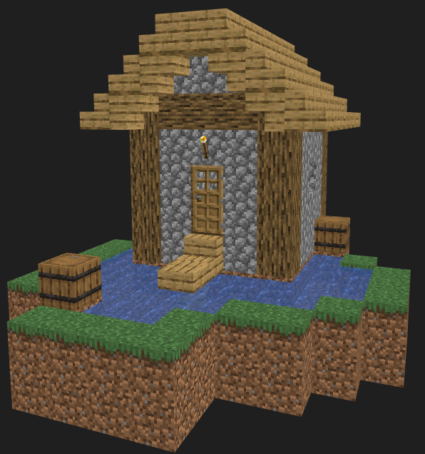
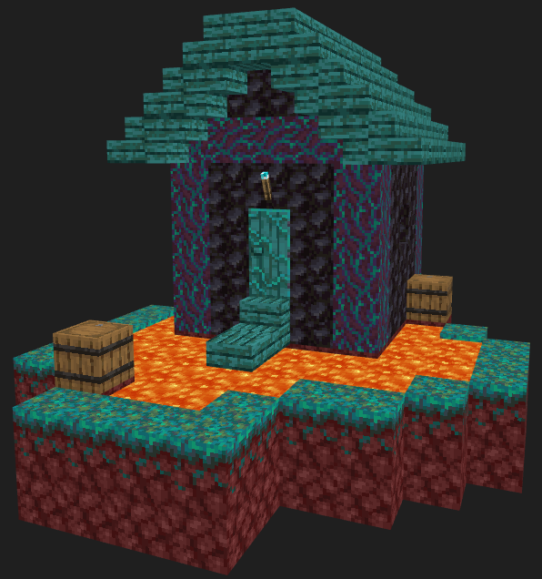

# Block Zapper


Block Zapper applies bulk edits to Minecraft structure NBT files using hierarchical TOML configuration.

## Example

<table width="100%">
  <tr>
    <td align="center">
      <strong>Before</strong><br>
      
    </td>
    <td align="center">
      <strong>After</strong><br>
      
    </td>
  </tr>
</table>

<p align="center"><em>NBT Renders from VSCode <a href="https://github.com/misode/vscode-nbt">NBT Viewer</a>.</em></p>


Using `nether.bz.toml` to define block replacements.

```toml
[block.simple]
"minecraft:grass_block" = "minecraft:warped_nylium"
"minecraft:dirt" = "minecraft:netherrack"
"minecraft:water" = "minecraft:lava"
"minecraft:cobblestone" = "minecraft:blackstone"
"minecraft:cobblestone_stairs" = "minecraft:blackstone_stairs"

# Torches on the wall have different block ids
"minecraft:wall_torch" = "minecraft:soul_wall_torch"

# Special treatment for warped stems aka logs
# Overlaps with the oak pattern. Requires "--allow-overlaps"
"minecraft:oak_log" = "minecraft:warped_stem"

# Replace with lava directly,
# otherwise waterlogged warped fence would stay waterlogged in the output
"minecraft:oak_fence" = "minecraft:lava"

[block.pattern]
# Covers doors, stairs, slabs, and (incorrectly) logs
"minecraft:oak_{part}" = "minecraft:warped_{part}"

```

## Configuration

Place exactly one file ending in `.bz.toml` in a directory. Its rules apply to
structure files in that directory and to all child directories by default. Child `.bz.toml` may override or combine with parent configuration.

```toml
# Apply these rules to child directories too (default true).
recursive = true

# Inherit and combine rules from parent directories (default true).
# Combined rules may lead to overlaps.
inherit = true

[block.simple]
# Replace an exact palette block ID.
"minecraft:cobblestone" = "minecraft:deepslate"

[block.pattern]
# Capture part of an ID with {name}, then reuse it in the replacement.
"minecraft:oak_{part}" = "minecraft:dark_oak_{part}"

[block.regex]
# Full regular expressions can use named capture groups.
"minecraft:(?:oak|spruce)_(?P<part>door|fence|planks|slab|stairs|trapdoor)" = "minecraft:dark_oak_{part}"

[string.simple]
# Change strings inside block/entity NBT payloads, such as container item IDs.
"minecraft:allium" = "minecraft:poppy"

[string.pattern]
"minecraft:oak_{item}" = "minecraft:dark_oak_{item}"

[string.regex]
"minecraft:(?:oak|spruce)_(?P<item>boat|chest_boat)" = "minecraft:dark_oak_{item}"
```

### Rule types and precedence

`block` rules operate on palette-entry block IDs. `string` rules operate only on
string values inside block and entity NBT payloads; they never modify palette
block IDs.

Rule types are evaluated in this order:

1. `simple` — exact IDs
2. `pattern` — `{placeholder}` templates
3. `regex` — full regular expressions with optional named capture groups

If more than one rule matches a value, BZ stops with an error by
default. Pass `--allow-overlaps` to continue. The first matching
rule at the highest precedence level wins.

## Command line options

```text
-n, --dry-run              Report replacements without creating output files.
--allow-overlaps           Warn instead of failing when rules overlap.
--allowlist FILE           Restrict replacement destinations to listed IDs.
--tree-output FILE         Write an ASCII tree of replacements to FILE.
-v, --verbose              Enable verbose output.
```

### Allowlist

`--allowlist` is a safety check for replacement destinations. It accepts either:

- a text file containing one `namespace:id` per line or
- a [ProbeJS](https://github.com/Prunoideae/ProbeJS) registry type file, from which `Block` and `Item` IDs are read.

When an allowlist is supplied, replacement block IDs must be in its block list.
Replacement strings in NBT payloads must be in its item list. If a replacement
destination is not allowlisted, BZ refuses to write output files.

## Testing

Integration tests require vanilla Minecraft 1.21.8 structure data downloaded from [misode/mcmeta](https://github.com/misode/mcmeta).

```sh
./cache-mcmeta-structures.sh
uv run pytest
```
